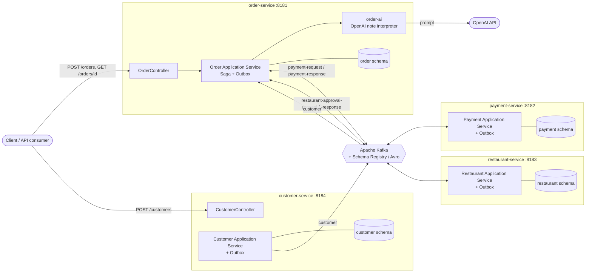
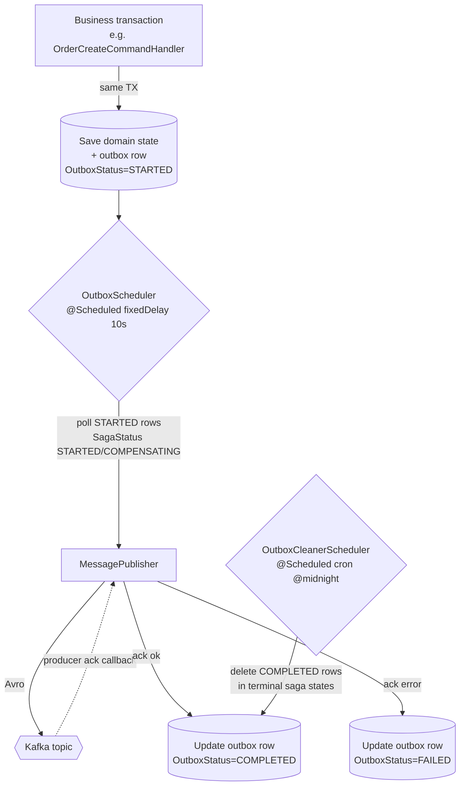
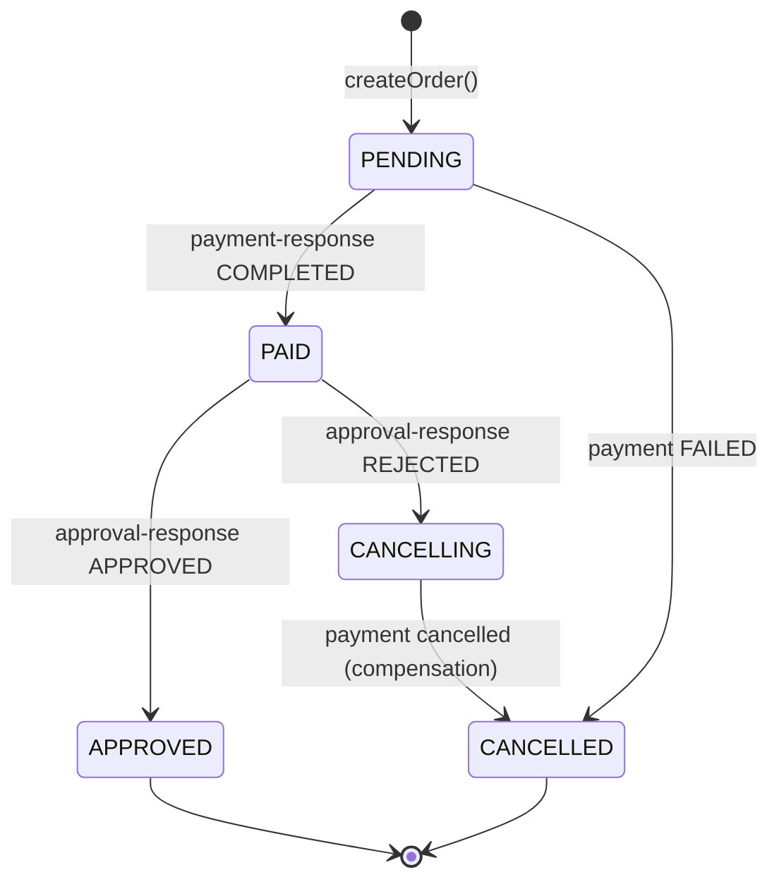
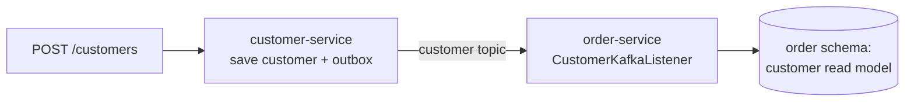

# Food Ordering System — Data Flow

This document describes how data moves through the system: from the inbound REST request,
across services via Kafka, and back to a final order state. It complements
[`project-overview.md`](./project-overview.md) and [`sequence-diagrams.md`](./sequence-diagrams.md).

All cross-service communication is **asynchronous over Kafka** using **Avro**-serialized
messages. Every outbound message is published through the **Outbox** pattern (transactional
write + scheduled publish), and the whole order lifecycle is coordinated by a **Saga**.

## 1. System Context / Component View

## 2. Kafka Topics & Producers / Consumers

| Topic | Produced by | Consumed by | Payload (intent) |
| --- | --- | --- | --- |
| `payment-request` | order-service | payment-service | Charge / cancel payment for an order |
| `payment-response` | payment-service | order-service | Payment completed / cancelled / failed |
| `restaurant-approval-request` | order-service | restaurant-service | Request order approval |
| `restaurant-approval-response` | restaurant-service | order-service | Order approved / rejected |
| `customer` | customer-service | order-service | Customer created (replicated read model) |

Cluster: 3 brokers (`19092/29092/39092`), `num-of-partitions: 3`, `replication-factor: 3`,
Schema Registry at `:8081`. Consumers are batch listeners with `concurrency-level: 3`.

## 3. The Outbox Data Flow (how a message actually reaches Kafka)

No service publishes to Kafka directly inside business logic. Instead it writes an **outbox
row in the same DB transaction** as the state change. A scheduler later polls the outbox and
publishes, updating the row's status — guaranteeing the state change and the event are never
out of sync (no dual-write problem) and giving at-least-once delivery.

Order-service maintains **two** outbox streams, each with its own scheduler + cleaner:
- **Payment outbox** → `payment-request` topic (`PaymentOutboxScheduler`)
- **Approval outbox** → `restaurant-approval-request` topic (`RestaurantApprovalOutboxScheduler`)

Polling is driven by `(OutboxStatus, SagaStatus)`:
the payment scheduler picks up `OutboxStatus.STARTED` rows in saga status `STARTED` or
`COMPENSATING`, so the same mechanism handles both the forward step and the compensation.

## 4. Saga State Progression

The order's `OrderStatus` is mapped to a `SagaStatus` and persisted on the outbox rows, making
each step idempotent (a message for an already-advanced saga is ignored).

| OrderStatus | SagaStatus | Meaning |
| --- | --- | --- |
| PENDING | STARTED | Order created, awaiting payment |
| PAID | PROCESSING | Paid, awaiting restaurant approval |
| APPROVED | SUCCEEDED | Order fully confirmed |
| CANCELLING | COMPENSATING | Rejected by restaurant, rolling payment back |
| CANCELLED | COMPENSATED / FAILED | Terminal failure / fully rolled back |

## 5. End-to-End Data Flow (happy path, summarized)

1. **Create** — `POST /orders` → order validated against local customer/restaurant read models;
   AI interprets order notes into `OrderPreferences`; `Order` saved as **PENDING**; a
   **payment outbox** row is written (same TX). REST returns immediately with a tracking id.
2. **Charge** — `PaymentOutboxScheduler` publishes to `payment-request`. payment-service
   debits the customer's credit, writes its own outbox, and emits `payment-response`.
3. **Pay** — order-service consumes `payment-response`; `OrderPaymentSaga.process` marks the
   order **PAID** and writes an **approval outbox** row.
4. **Approve** — `RestaurantApprovalOutboxScheduler` publishes `restaurant-approval-request`.
   restaurant-service decides and emits `restaurant-approval-response`.
5. **Confirm** — order-service consumes the response; `OrderApprovalSaga.process` marks the
   order **APPROVED**. Terminal success.

If any step fails, the saga runs **compensating transactions** in reverse (see
[`sequence-diagrams.md`](./sequence-diagrams.md) §4).

## 6. Customer Replication Data Flow

order-service needs to validate the customer locally before creating an order, so customer data
is replicated via events rather than synchronous calls:

This keeps the create-order path self-contained — `OrderCreateHelper.checkCustomer()` reads
the local replica instead of calling customer-service over the network.
