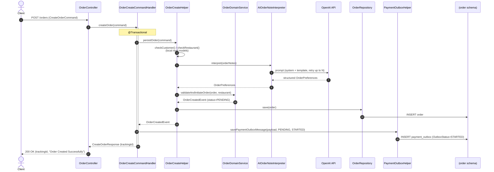
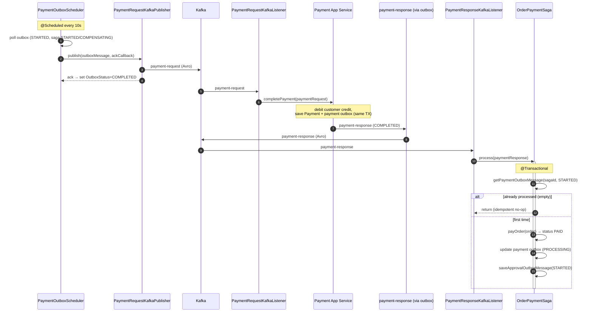
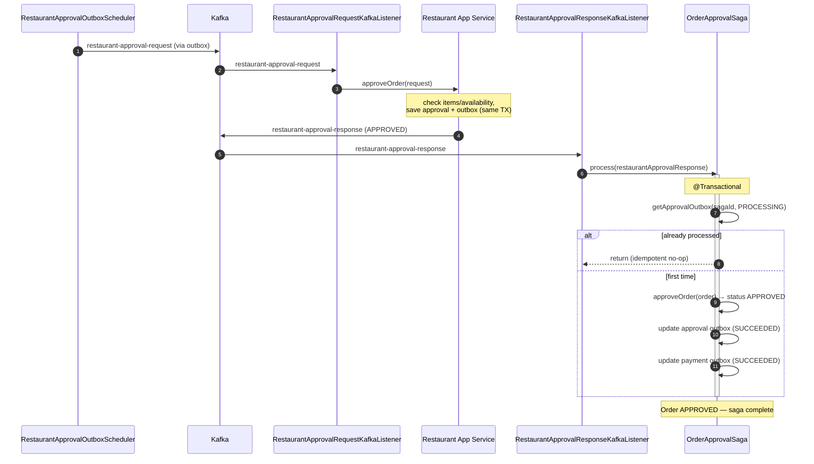
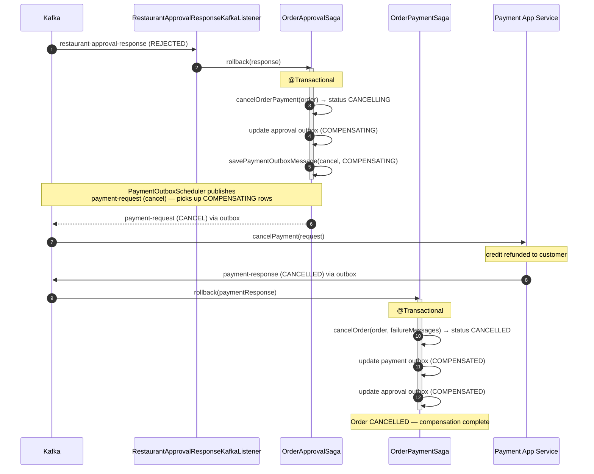
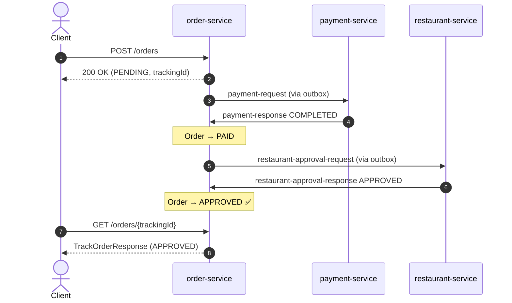
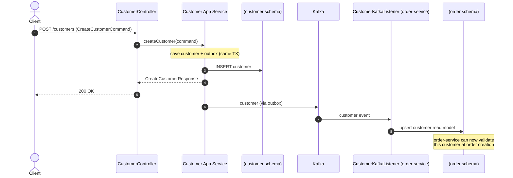

# Food Ordering System — Sequence Diagrams

Detailed interaction flows for the main use cases. These mirror the actual implementation
(`OrderCreateCommandHandler`, `OrderPaymentSaga`, `OrderApprovalSaga`, the outbox schedulers,
and the Kafka listeners/publishers). See [`data-flow.md`](./data-flow.md) for the topic-level
view and [`project-overview.md`](./project-overview.md) for architecture.

Diagrams use Mermaid. The recurring **Outbox + Scheduler** hop (write row in TX → scheduler
polls → publisher emits Avro → status set to COMPLETED) is shown explicitly the first time and
abbreviated as "via outbox → topic" afterwards.

---

## 1. Create Order (synchronous request + AI interpretation)

> The customer/restaurant checks read **local replicas** in the order schema (populated via the
> `customer` topic and seeded restaurant data) — no synchronous cross-service call.
> If the AI interpreter fails after its retries, order creation aborts (the whole TX rolls back).

---

## 2. Payment Step (order → payment → order)

---

## 3. Restaurant Approval Step (order → restaurant → order) — Happy Path

---

## 4. Compensation — Restaurant Rejects the Order

When the restaurant rejects an already-**PAID** order, `OrderApprovalSaga.rollback` runs and
emits a payment-cancel request; payment-service refunds, and `OrderPaymentSaga.rollback`
finalizes the order as **CANCELLED**.

> A **payment failure** at step 2 (instead of restaurant rejection) follows the same pattern:
> `OrderPaymentSaga.rollback` is invoked directly with `PaymentStatus.FAILED`, cancelling the
> order without ever reaching the restaurant. `getCurrentSagaStatus()` maps the payment status
> to the saga states eligible for rollback (`STARTED` / `PROCESSING`).

---

## 5. End-to-End Happy Path (condensed)

---

## 6. Create Customer & Replication to order-service

---

## Notes on Idempotency & Reliability

- **Idempotent saga steps** — every `process`/`rollback` first looks up the outbox row by
  `(sagaId, expected SagaStatus)`. If it's missing/already advanced, the step is a no-op, so
  duplicate Kafka deliveries (at-least-once) are safe.
- **Atomicity** — domain state and the outbox row are written in one `@Transactional` unit;
  publishing happens later from the committed row, so a crash can never lose an event or emit
  one for an uncommitted state.
- **Cleanup** — `*OutboxCleanerScheduler` deletes `COMPLETED` outbox rows to bound table growth.
